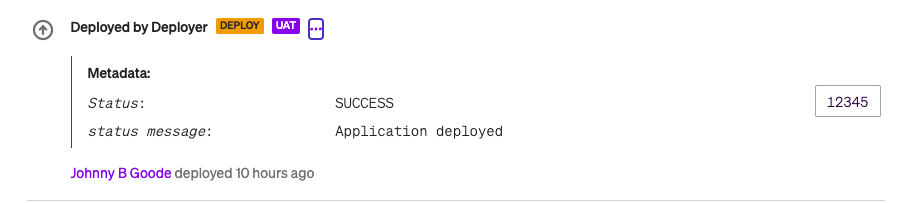

## Testing Commands

Command I am using to test the python script. I set my cortex API token and cortex tag as env variables ($CORTEX_API_TOKEN & $CORTEX_TAG).

```shell
python3 deploy.py -k $CORTEX_TOKEN -s 1234 -t DEPLOY -e Prod -c '{"cluster": "Prod"}' -d "deploy person" -l deploy.person@example.com  -g $CORTEX_TAG
```

The above command will create an event like this on the service you specify with the CORTEX_TAG:

