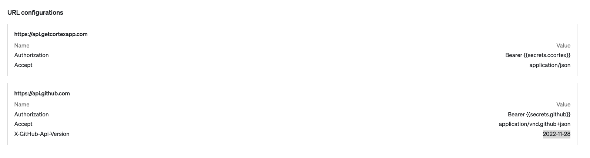
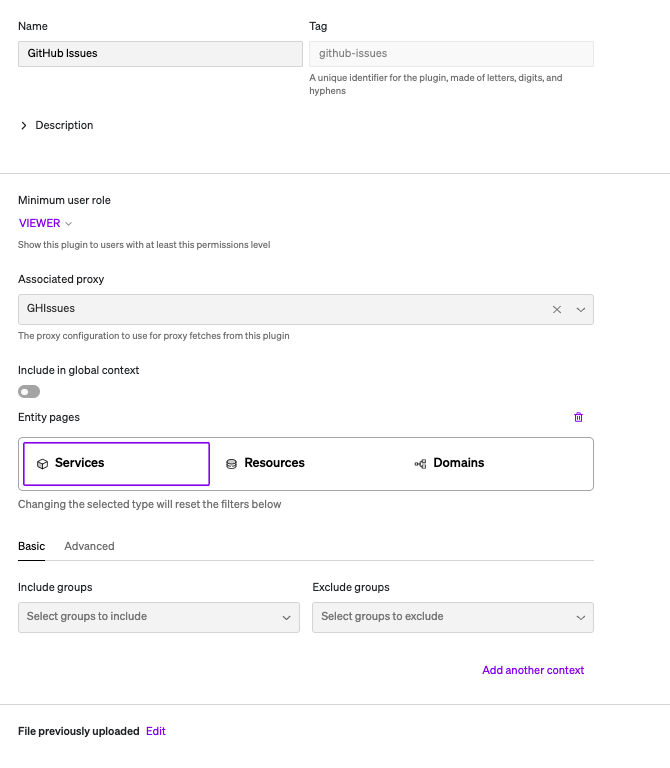
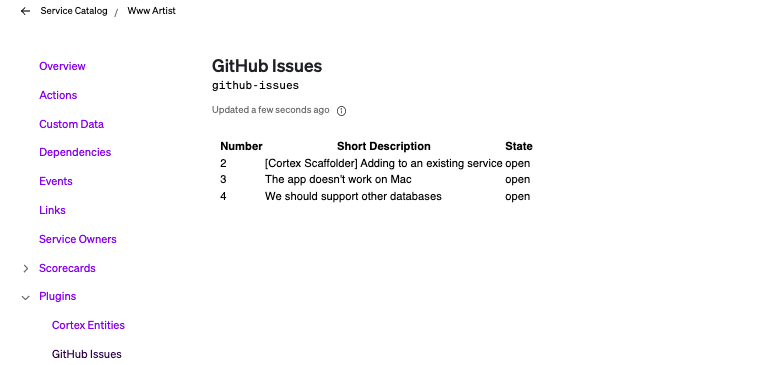

## GitHub Issues Plugin

This plugin allows to see GitHub issues associated with the GitHub repository associated to a given service.

**This only works with GitHub**

### How the plugin works

This plugin is only meant to work from inside a Service screen.

The plugin uses the [context API](https://docs.cortex.io/docs/plugins#accessing-contextual-cortex-information-from-your-plugin) to retrieve the tag of the Service where the plugin is running.

Once it has the tag, it uses the [Cortex REST API](https://docs.cortex.io/docs/api/get-entity-descriptor-1) to retrieve details about the entity to get the GitHub repo associated with the service. **If it does not have a GitHub repo associated the plugin will not show anything**

The plugin uses the GitHub repo, which is in the `owner/repo` format, with the [GitHub API](https://docs.github.com/en/rest/issues/issues?apiVersion=2022-11-28#list-repository-issues) to get the list of issues associated to the repo.

### How to Set Up the Plugin

#### Set up Secrets

Follow the [documentation](https://docs.cortex.io/docs/plugins/secrets) on how to create secrets. For this plugin we'll need two plugins:

* Cortex API Keys - We'll use this to get the GitHub repo associated to the service
* GitHub Personal Access Token (classic) - We'll use this to get the list of issues.

#### Set up the Proxy

Follow the [documentation](https://docs.cortex.io/docs/plugins/plugin-proxies) on how to create a proxy. We will need two URLs with headers for this plugin:
* **URL:** https://api.getcortexapp.com
  **Headers**:
  Authorization - Bearer {{secrets.**your-cortex-api-secret**}}
  Accept - application/json
* **URL:** https://api.github.com
  Authorization - Bearer {{secrets.**your-github-token-secret**}}
  Accept - application/vnd.github+json
  X-GitHub-Api-Version - 2022-11-28

Here is what your Proxy may look like after you have configured it:

#### Set Up the Plugin

Create a new plugin as follows:

**Name:** Give your plugin a meaninful name as this will be displayed in the `Plugins` menu
**Minimum user role:** By default this is set to `viewer`, which means everyone will be able to see this plugin once published. You can change this if you wish to restrict who can see this plugin. Note that only Admins will see the plugin while in `Draft` mode.
**Associated Proxy:** Select the Proxy you created in the previous step
**Include in global context:** Untoggle this as this plugin will not work in the global context.
**Add another context:** Click on this to add `Services` as the entity page. This means the plugin will only be visible from the Service page.
**Plugin code:** To use the plugin as-is, you can browse and add the `ui.html` file found under the `dist` folder.

Once complete, your plugin configuraiton should look similar to this:

Please note that the styling at this time is very rudimentary. This is the next step on this plugin. Here is an example of how the plugin looks at the moment:

if you want to iterate on this plugin, you can pull this locally and follow the instructions in the ReadMe file in the `CortexPlugin` folder.