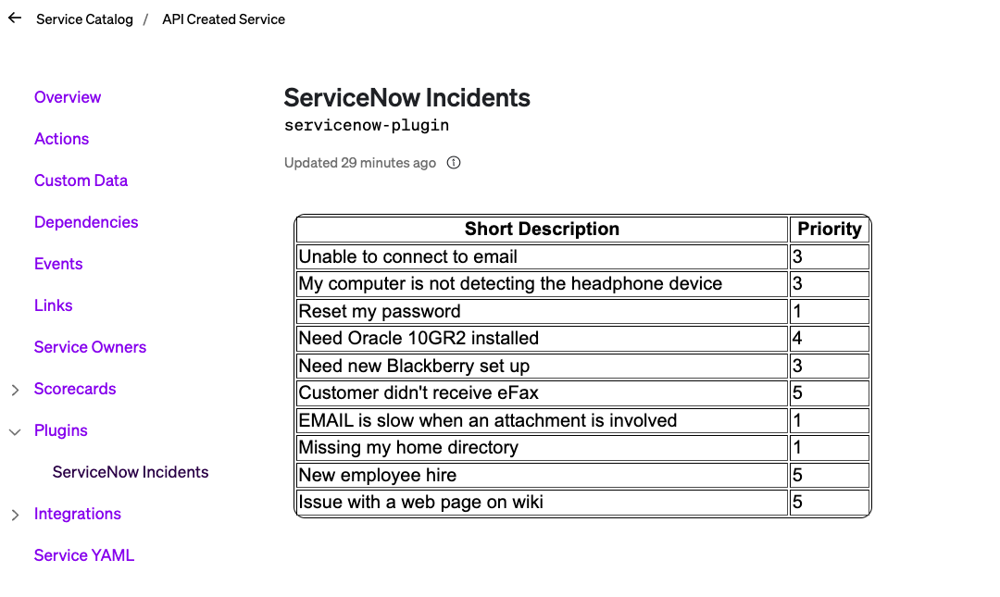

# ServiceNow Sample Plugin

This is a simple example of how to leverage Cortex plugins to retrieve incidents from ServiceNow

The project was scaffolded using Cortex's [cookiecutter template](https://github.com/cortexapps/cookiecutter-cortex-plugin) and it was tested against a ServiceNow development instance with the sample data it contains.



## Notes

* The plugin is set up to retrieve all incidents associated to a Configuration Item (table `cmdb_ci`) that has a name that matches the name of the Service in Cortex. If your instance of ServiceNow tracks services in a different table, you will need to change the field in this section of the /src/components/App.tsx file to use that table:

```typescript

      const result = await CortexApi.proxyFetch(
        `https://dev93537.service-now.com/api/now/table/cmdb_ci?sysparm_query=name%3D${cortexService}`
      );
 
```
  You will also need to make sure that this table is set up as a `reference field` in your Incidents table.

* The plugin will only work when used within the context of a Service.

* Set up the Cortex Proxy with the following headers:
    * `Accept`: `application/json`
    * `Content-Type`: `application/json`
    * `Authorization`: `Basic <64bit endocded username:password>`

*To encode your username and password, [this](https://www.debugbear.com/basic-auth-header-generator) tool is pretty handy.*

## SetUp

### Prerequisites

Developing and building this plugin requires either [yarn](https://classic.yarnpkg.com/lang/en/docs/install/) or [npm](https://docs.npmjs.com/downloading-and-installing-node-js-and-npm).

## Getting started

1. Run `yarn` or `npm install` to download all dependencies
2. Run `yarn build` or `npm run build` to compile the plugin code into `./dist/ui.html`
3. Upload `ui.html` into Cortex on a create or edit plugin page
4. Add or update the code and repeat steps 2-3 as necessary

### Notable scripts

The following commands come pre-configured in this repository. You can see all available commands in the `scripts` section of [package.json](./package.json). They can be run with npm via `npm run {script_name}` or with yarn via `yarn {script_name}`, depending on your package manager preference. For instance, the `build` command can be run with `npm run build` or `yarn build`.

* `build` - compiles the plugin. The compiled code root is `./src/index.tsx` (or as defined by [webpack.config.js](webpack.config.js)) and the output is generated into `dist/ui.html`.
* `test` - runs all tests defined in the repository using [jest](https://jestjs.io/)
* `lint` - runs lint and format checking on the repository using [prettier](https://prettier.io/) and [eslint](https://eslint.org/)
