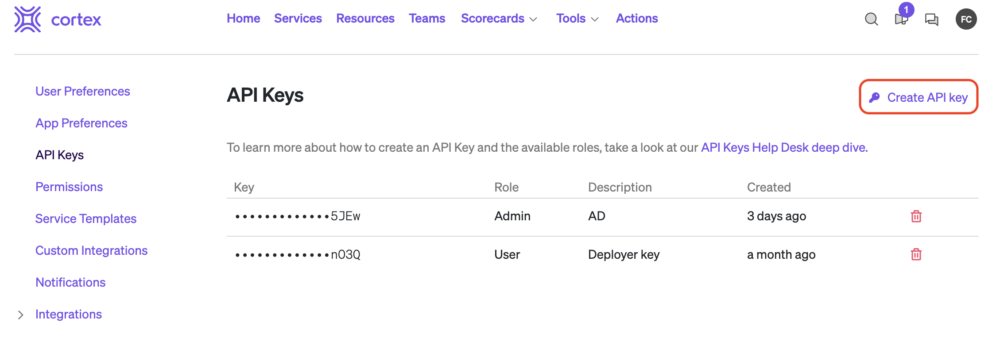
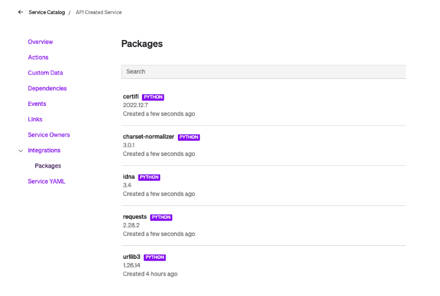

## Getting Started with the Cortex API

This folder contains sample files to help you get started learning the Cortex API. This document is a tutorial to help you get started with the Cortex API.

## Table of Contents

[References](#references)

[Prerequisites](#prerequisites)

[Creating Catalog Entities](#creating-catalog-entities)

[Creating a Service](#creating-a-service)

[Creating a Resource](#creating-a-resource)

[Creating a Custom Resource](#creating-a-custom-resource)

[Adding Teams](#adding-teams)

[Adding an Owner to a Catalog Entity](#adding-owner-to-a-catalog-entity)

[Adding Custom Data to a Catlog Entity](#adding-custom-data-to-a-catalog-entity)


## References

Docs: https://docs.cortex.io/api

## Prerequisites

The examples provided leverage Python's [request](https://requests.readthedocs.io/en/latest/) library. If you want to follow along, make sure to install Python, and use pip to install the libary.

You will also need an API token for Cortex. This token will authenticate against your Cortex instance. To get your API token, select `settings` in the user profile menu.


<p align="center"></img></p>

On the left hand meny, select **API Keys** and then click on **Create API Key**

<p align="center"></img></p>

Select **User** for the API Key Role. If you are planning doing a deep dive on our API, then the  **Admin** may be a better option.

Use this token to replace the `your-api-token-goes-here` value in the Python scripts.

### Creating Catalog Entities

To create a [catalog entity](https://docs.cortex.io/docs/reference/basics/entities) via API you have to define an OpenAPI [spec](https://docs.cortex.io/docs/reference/basics/entities#catalog-descriptor) (yaml). We are not going to cover how to programmatically create & edit Yaml files as there are various ways to do this. We are going to focus on the Cortex side of things.

#### Creating a Service

To create a service, we are going to define a basic spec, but if you would like more information, please refer to this page: https://docs.cortex.io/docs/reference/basics/entities#resource-entities. Our spec, however, just has the basic information needed.

```yaml
#new-service.yaml
openapi: 3.0.0
info:
  version: 1.0.0
  title: API Created Service
  description: Service for testing API
  x-cortex-tag: api-created-svc

```

Cortex provides an [endpoint](https://docs.cortex.io/docs/setup/gitops#api-upload) for uploading spec files.

Below is a sample Python script which you can use to upload the file:

```Python
import requests

api_token = 'your-api-token-goes-here'

with open('./new-service.yaml', 'rb') as f:
    data = f.read()

api_url = 'https://api.getcortexapp.com/api/v1/open-api'
headers = {
      'Authorization': 'Bearer ' + api_token,
      'Content-Type': 'application/openapi'
      }


resp = requests.post(url=api_url, data=data, headers=headers)
print(resp)

```

Running the above script creates a service for us:

<p align="center"></img></p>


### Creating a Resource

You can follow the same pattern as above with [resources](https://docs.cortex.io/docs/reference/basics/entities#resource-entities), but you need to add an additional tag, which is `x-cortex-type`, which maps to the [resource definition](https://docs.cortex.io/docs/reference/basics/resource-catalog#resource-definitions). The resource type shows in lower case as shown below:


<p align="center"></img></p>

For example, if we wanted to define a resource of type `aws-kafka` we would use something like this:

``` yaml
#new-resource.yaml
openapi: 3.0.1
info:
 title: My Kafka
 description: this was created by api
 x-cortex-tag: my-kafka-api
 x-cortex-type: aws-kafka

```

If we re use the sampe Python the script (but updated to use the resource spec):

``` Python

import requests

api_token = 'your-api-token-goes-here'

with open('./new-resource.yaml', 'rb') as f:
    data = f.read()

api_url = 'https://api.getcortexapp.com/api/v1/open-api'
headers = {
      'Authorization': 'Bearer ' + api_token,
      'Content-Type': 'application/openapi'
      }


resp = requests.post(url=api_url, data=data, headers=headers)
print(resp)

```

We now have our first resource:

<p align="center"></img></p>

## Creating a Custom Resource

Cortex  comes with many predefined resource types, but you can define your own as well. When adding a new resource of a custom type, you have to add the x-cortex-definition block as explained here https://docs.cortex.io/docs/reference/basics/resource-catalog#yaml-definition

Consider the following Custom Resource Definition:

<p align="center"></img></p>

To create a resource of this type, you would use a spec similar to this:

```yaml
#new-api-resource.yaml
openapi: 3.0.0
info:
  title: My new API
  description: I wrote this
  x-cortex-tag: my-new-api
  x-cortex-type: api 
  x-cortex-definition:
    version: 1.0.0

```

We can then reuse our script to create this catalog entity:


```Python
import requests

api_token = 'your-api-token-goes-here'

with open('./new-api-resource.yaml', 'rb') as f:
    data = f.read()

api_url = 'https://api.getcortexapp.com/api/v1/open-api'
headers = {
      'Authorization': 'Bearer ' + api_token,
      'Content-Type': 'application/openapi'
      }


resp = requests.post(url=api_url, data=data, headers=headers)
print(resp)

```

Browse to your Resource catalog and you should find an entry for our API resource:

<p align="center"></img></p>

## Adding Teams

To create a team we can use the [Team API](https://docs.cortex.io/api#tag/Teams).

Here is a simple example that creates a team with minimal details (note that you still need to include the arrays for links, slack channels, etc… even if they are empty).

```Python
#add-team.py
import requests

api_token = 'your-api-token-goes-here'

api_url = 'https://api.getcortexapp.com/api/v1/teams'
headers = {
      'Authorization': 'Bearer ' + api_token,
      'Content-Type': 'application/json'
      }

json_body = {

    "type": "cortex",
    "teamTag": "cortex-team",
    "metadata": {
        "name": "Cortex Managed Team",
        "description": "Example of Cortex Managed Team created by API",
        "summary": "API created team"
    },
    "links": [],
    "slackChannels": [],
    "additionalMembers": [],
    "cortexTeam": {
        "members": []
    }
}

resp = requests.post(url=api_url, json=json_body, headers=headers)
print(resp)
print(resp.text)

```
Checking the Cortex UI we can now see the team created:

<p align="center"></img></p>

## Adding Owner to a Catalog Entity

Now that we have a team greated we can make it the owner of a catalog entity. To do this, you must add the `x-cortex-owner` block to the spec. The block will depend on the provider. This [reference YAML](https://github.com/cortexapps/solutions/blob/master/examples/yaml/cortex.yaml) contains examples for all third party providers, but in this example we will use teams defined in Cortex.

If we wanted to add an owner to our previously created service, we append the ownership block:

```yaml
#service-w-owner.yaml
openapi: 3.0.0
info:
  version: 1.0.0
  title: API Created Service
  description: Service for testing API
  x-cortex-tag: api-created-svc
  x-cortex-owners:
    - type: group
      name: cortex-team
      provider: cortex
```
And then re use our Python script to upload this spec:

```Python
import requests

api_token = 'your-api-token-goes-here'

with open('./service-w-owner.yaml', 'rb') as f:
    data = f.read()

api_url = 'https://api.getcortexapp.com/api/v1/open-api'
headers = {
      'Authorization': 'Bearer ' + api_token,
      'Content-Type': 'application/openapi'
      }


resp = requests.post(url=api_url, data=data, headers=headers)
print(resp)
```

<p align="center"></img></p>

## Adding Custom Data to a Catalog Entity

You may have home grown tools that are capturing relevant data for your services or resources. Cortex provides two ways to send [custom data](https://docs.cortex.io/docs/reference/basics/custom-data#defining-custom-data) to your services or resources. One is when you [know the tag](https://docs.cortex.io/docs/reference/basics/custom-data#api) of the entity and the other one is when you [do not](https://docs.cortex.io/docs/reference/basics/custom-data#webhook). In this example, we are going to show the [endpoint](https://docs.cortex.io/api#tag/Custom-Data/operation/createCustomData) when you do know the tag.

Below is a sample Python script that sends some JSON payload as custom data. In this example below we are sending data from a home grown tool. In the example below we are using nested JSON:

```Python

import requests
from datetime import datetime

cortex_tag = 'api-created-svc'
time_stamp= datetime.now().replace(microsecond=0).isoformat() + 'Z'

api_token = 'your-api-key'

api_url = 'https://api.getcortexapp.com/api/v1/catalog/' + cortex_tag + '/custom-data'
headers = {
     'Authorization': 'Bearer ' + api_token,
     'Content-Type': 'application/json'
     }

json_body = {

   "key": "some-internal-tool",
   "value": {
       "tool": "home-grown build tool",
       "custom scan result": "failed!",
       "details": { "scan-id": "456", "branch" : "main", "timestamp" : time_stamp }
   },
   "description": "Scan data uploaded by REST API"
   }

resp = requests.post(url=api_url, json=json_body, headers=headers)
print(resp)
print(resp.text)

```

Note that the actual custom data is provided under `value`.

Running this script adds custom data to our previously created service:

<p align="center"></img></p>

## Adding Packages to a Service

As part of a service or resource, you may want to understand any 3rd party libraries that are being used by the service.  Cortex can consume package files from your Git Repo, but you can also populate it via the API.

Since we have been providing examples in Python, we’ll use the [endpoint](https://docs.cortex.io/api#tag/Packages/operation/uploadRequirementsTxt) that allows us to upload a requirements.txt file which was created by running the [pip freeze](https://pip.pypa.io/en/stable/cli/pip_freeze/#cmdoption-r) command.

Note that since we are uploading the entire file, it will override any previous information. For example, if you uploaded a file last week with libraries a, b and c, and today you upload a file with libraries x, y and z, in Cortex you will only see x, y and z.

For our example, we are going to upload a file with the following contents:

```
certifi==2022.12.7
charset-normalizer==3.0.1
idna==3.4
requests==2.28.2
urllib3==1.26.14

```

Here is a sample Python script that uploads a requirements.txt file. 

``` Python

import requests

cortex_tag = 'api-created-svc'
api_token = 'your-api-token-goes-here'
api_url = 'https://api.getcortexapp.com/api/v1/catalog/' + cortex_tag + '/packages/python/requirements'
headers = {
     'Authorization': 'Bearer ' + api_token,
     'Content-Type': 'application/json'
     }
json_body = ''
with open('requirements.txt') as f:
   body = f.read()
   resp = requests.post(url=api_url, data=body, headers=headers)
   print(resp)
   print(resp.text)

```
After running this script, we now have these packages listed:

<p align="center"></img></p>

## Adding Deploys to a Service

Cortex also has an [endpoint](https://docs.cortex.io/api#tag/Deploys/operation/saveDeploy_1) that allows you to send deploy information. Each time we send this to Cortex, it will create a new deploy event for that service.

What’s unique about this is that you can define custom meta-data on the fly. 

Here is a snippet of a Python script that takes various information about the deploy event as parameters and then assigned to variables to send this information to Cortex

``` Python
env = args.env
status = args.status
status_msg = args.status_msg
deployer  = args.deployer
time_stamp= datetime.now().replace(microsecond=0).isoformat() + 'Z'
deployer_email = args.deployer_email
api_token = args.api_token
api_url = 'https://api.getcortexapp.com/api/v1/catalog/' + cortex_tag + '/deploys'
headers = {
   'Authorization': 'Bearer ' + api_token,
   'Content-Type': 'application/json'
   }
json_body = {
   "title": "Deployed by Deployer",
   "timestamp": time_stamp,
   "type": deploy_type,
   "sha": commit_sha,
   "deployer": {
     "name": deployer,
    "email": deployer_email
   },
   "environment": env,
   "customData": {
     "Status": status,
     "status message": status_msg
   }
 }
response = requests.post(api_url, json=json_body, headers=headers)

```
In the above example, the customData section is where  you can specify any custom medata 
you want. In my example, I am defining two fields by passing a status and a message.

Once you send it to Cortex, you will see the data under Integrations > Deploys as shown on the next screenshot.

<p align="center"></img></p>

Note in the screenshot above how you can filter by the custom data you define.

## Adding Dependencies

Cortex provides an endpoint that allows you to manage dependencies between catalog entities. Before going much further, please review the documentation as it provides a very thorough explanation including how to use the API.

In our example, we are going to set up a dependency between the service and resource we created in the previous steps.

``` Python
import requests

api_token = 'your-api-token-goes-here'
caller_tag = 'api-created-svc'
callee_tag = 'my-kafka-api'

api_url = 'https://api.getcortexapp.com/api/v1/catalog/' + caller_tag + '/dependencies/' + callee_tag
headers = {
     'Authorization': 'Bearer ' + api_token,
     'Content-Type': 'application/json'
     }


json_body = {


   "description": "This is a dependency created by the API",
   "metadata": {
       "tags": ["tier1", "external"]
    }
}

resp = requests.post(url=api_url, json=json_body, headers=headers)
print(resp)
print(resp.text)
```

When we look at our service’s dependency, we can see the one created by the above script

<p align="center"></img></p>

