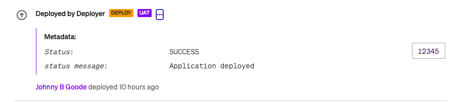

## Deployer App

Basic Python 3 application that uses the `requests` library to send a REST call using the Cortex API to add a Deploy event to a service.



The [test.md](test.md) file provides a test command to run a test locally.

A Dockerfile is also included for your convenience so you don't have to worry about setting up Python and dependencies.

## Usage

```bash

usage: 

deploy.py [-h] -k API_TOKEN -s COMMIT_SHA -g CORTEX_TAG -t TYPE -e ENV
                 -u STATUS -m STATUS_MSG -d DEPLOYER -l DEPLOYER_EMAIL
or

docker run deployer:latest [-h] -k API_TOKEN -s COMMIT_SHA -g CORTEX_TAG -t TYPE -e ENV
                 -u STATUS -m STATUS_MSG -d DEPLOYER -l DEPLOYER_EMAIL
```

## Integrating with CD tools

Most CD tools provide a way to run a container. Each one may have different ways to pass the arguments, especially when using dynamic values (i.e., sha, tokens, etc... ). Here are some snippets to help you get started.

### Jenkinsfile

In this example, we have added Jenkins [credentials](https://www.jenkins.io/doc/book/using/using-credentials/) to store information like the Cortex API token and Cortex tag.

```shell
pipeline {
  environment {

    CORTEX_API_TOKEN= credentials ('cortex-api-token')
    CORTEX_TAG = credentials ('cortex-tag')
  }
  stages {
    stage ('deploying') {
      steps {
        sh '''
        echo "This step is where the app is deployed
        '''
      }
    }
    stage ('dockerization') {
      steps {
        sh '''
       docker run cremerfc/deploy -s ${ env.BUILD_TAG } -g $CORTEX_TAG -k $CORTEX_API_TOKEN -t "DEPLOY"
        '''
      }
    }
  }
}
```

## GitHub Actions

Here is a sample GitHub Action. In this example we added Secrets to store the Cortex API Token and Cortex Tag:

```yaml

name: 'Deployer Cortex GitHub Action'
description: 'A GitHub Action that runs the Deployer App'

on: push

jobs:
  add_deploy_event_cortex:
    runs-on: ubuntu-18.04
    steps:
      - name: mock_deploy
        id: deploy
        
      - uses: docker://cremerfc/deploy:0.1
        with:
          args: >- # allows you to break string into multiple lines
            -k ${{ secrets.CORTEX_API_TOKEN }}
            -s ${{ ${{ github.sha }}}}
            -d GitHub Actions
            -g ${{ secrets.CORTEX_TAG}} 
            -t "DEPLOY"
            -e Prod
            -u {{ steps.deploy.outcome }}

```

## Azure DevOps

Azure DevOps has a conatiner job available, however it does require Node.js to be in the image (it is currently not). Would probably need to modify the image based on https://learn.microsoft.com/en-us/azure/devops/pipelines/process/container-phases?view=azure-devops

## Spinnaker

Spinnaker has a [Run job](https://spinnaker.io/docs/reference/pipeline/stages/#run-job) step in their pipeline. This will require to create a Kubernetes Job manifest, similar to the one found [here](https://docs.liquibase.com/workflows/liquibase-community/using-the-run-job-pipeline-stage-with-spinnaker.html)