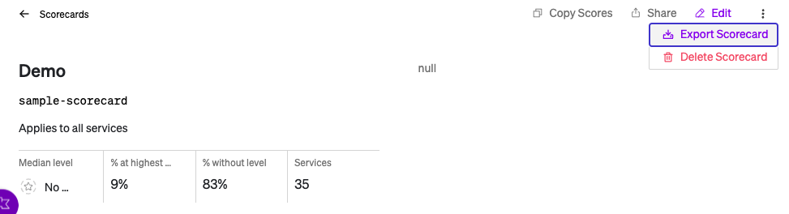

# Knowledge Trasfer
## A Set of Scripts for moving knowledge from SaaS to self-hosted brought to you by the nuerons at Cortex!

Scripts:
* **kt.py:** Transfers services from one instance to another. To get this working, update the fields in kt.py to match your backend API instance info and match your SaaS and self-hosted API keys and then run a `pip3 install`. Once you've done that, simply run `python3 kt.py` and grab a cup of coffee and watch as you transfer one brain to another!

* **add-sc.py:** Imports Scorecards downloaded from the UI. Follow the following steps to use this script
  * Download the file to a folder
  * Create a folder called `yamls`
  * Log in to your cortex intsance that contains the scorecards and download each one (see screenshot below). Copy them to the 'yamls' directory you created in the previous step
  
  
  
  * Make sure you have Python v3 installed and have the following dependencies (use `pip install` for those you don't have)
    * os
    * requests
    * json
    * yaml
    * io
  * Set an environment variable for your API token (`export CORTEX_API_TOKEN=<your token>`).
  * Run the script!
