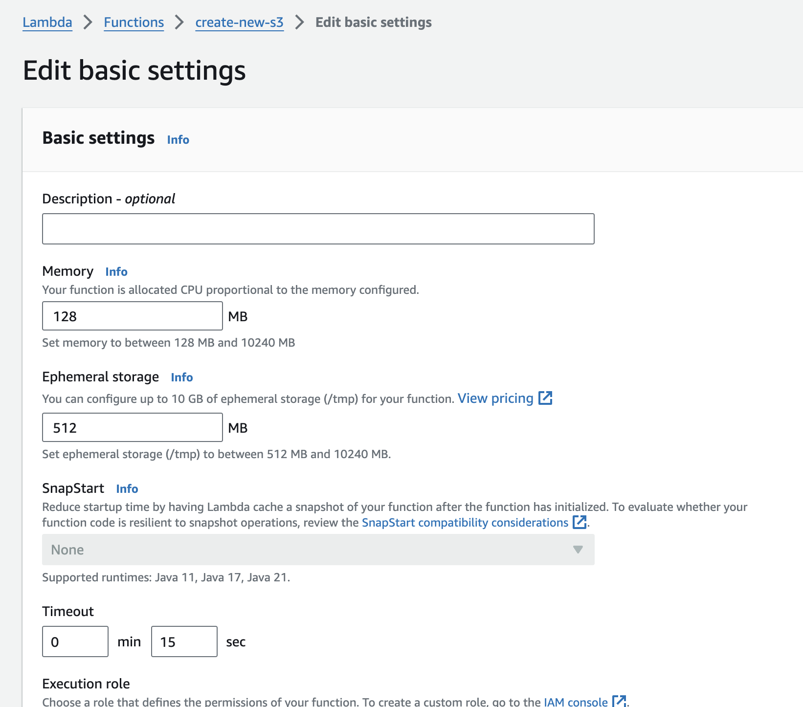
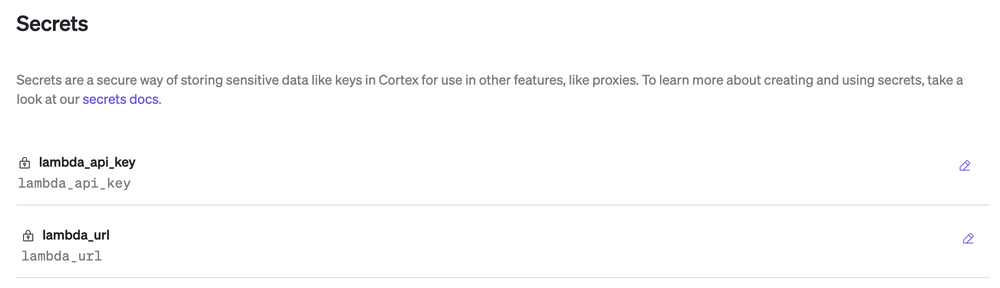

# Using Workflows to Provision an s3 Bucket

This template shows how to use a Lambda function to create a cloud resource in AWS, in this case, an S3 bucket.

## Creating the Lambda Function

Create a new Lambda function from scratch. Below is a screenshot of what options to select. Note that we are selecting Python as the language:


Use the following as the code:

```python
import logging
import boto3
import re
import random
import string
from botocore.exceptions import ClientError


"""
:param bucket_name: Bucket to create
"""


def lambda_handler(event, context):
    
    # Create bucket
    try:
            bucket_name = event['bucket_name']
            # the bucket name needs to be machine readable (no spaces or caps)
            bucket_name = re.sub(r"[^a-zA-Z\d]", ' ', bucket_name.strip()).lower().strip()
            bucket_name = re.sub(r'\s+', '-', bucket_name)
            # the bucket name needs to be unique, so adding 10 random digits to the end.
            result = ''.join(random.choices(string.ascii_lowercase + string.digits, k = 10))
            bucketname = bucket_name + '-' + str(result)
            s3_client = boto3.client('s3', region_name='us-west-1')
            location = {'LocationConstraint': 'us-west-1'}
            s3_client.create_bucket(Bucket=bucketname, CreateBucketConfiguration=location)
    except ClientError as e:
        logging.error(e)
        return False
    return True


```

Make sure to click on the **Deploy** button to publish the code!

Functions are by default set to timeout after 3 seconds. This function may take longer so we need to update the timeout. To do this, click on Configuration > General Configuraiton and Edit. There you can set the timeout to whatever you'd like. In the screenshot below you see the timeout set to 15 second.



Next, we need to add an API gateway so we can trigger this function. To add it, click on the **Add Trigger** button and select API Gateway.


Create a new REST API as shown below


The REST API will by default have an 'any' method. For our function, we want a POST method, so create a new method as shown below.


The last piece we need to do is ensure that the function has the right permissions to create the S3 bucket. When we generated this new Lambda function, we selected to have it generate a new role with basic Lambda permissions. In order for this Lambda function to create an S3 bucket, it needs the proper permissions. Go to Configuration > Permissions to find the new role that was created as shown below.


For the purpose of this example, we attached the AmazonS3FullAccess policy.

## Test the Function

Let's make sure the function works. To test the function go the API to test this. As shown below, we show how we are testing the POST method we created:


## Using the template

The Template requires the following secrets to be configured:

**lambda_api_key**: This is automatically generated for you. This is found also in the API we generated as shown here:


**lambda_url**: This is the `invoke url` for the API we created and can be found as shown here:


Ensure that the secrets are created with the names as shown below as the template will expect these secrets to exist:



